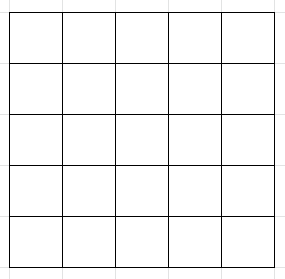
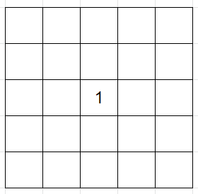
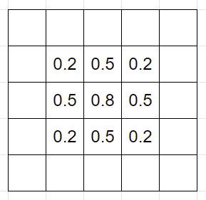
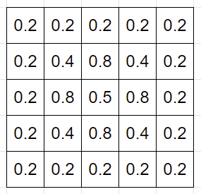
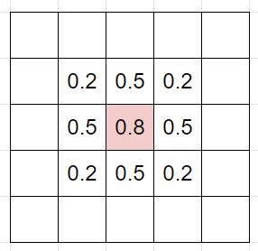
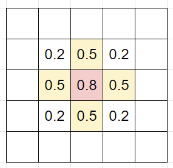

# divart.jsで波紋を表現する

## 概要

大量のdivを並べて、divの色をリアルタイムに変化させることで波紋っぽく見えるものを作ってみようという誰トクなネタプログラミング。

今回やる事をざっくりまとめると、**波の高さを計算で求めて**、波の高さによってdivの色を変化させることで波紋っぽく見せるということ。


>  また実際にちゃんと波のシミュレーションをしようとすると時間や距離などの単位も重要っぽいけど、今回実装するのはそこらへん曖昧ななんちゃってシミュレーションである。


とりま、以下に5x5のdivがあるとする。





波というのは高くなったり低くなったりを繰り返しながらだんだんと収まっていく動きをするので、仮にこのdivの中心で波が発生した場合、波は中心から周りに広がっていく。以下はそのイメージ。

| Step1                                                        | Step2                                                        | Step3                                                        |
| ------------------------------------------------------------ | ------------------------------------------------------------ | ------------------------------------------------------------ |
|  |  |  |
| 中心に高さ1の波が発生                                        | 中心から周りに波が広がっていく                               | 更に広がっていく                                             |


そしてこの波の高さを求めるために使うのが以下の意味が解らないであろう**波動方程式**である。
$$
\frac{1}{s^2} \frac{\partial^2 u}{\partial t^2} = \Delta u
$$
というわけで、**波動方程式**で波の高さを求めて、その高さでdivの色を決定するというのが今回のテーマ。


## 方程式とは

波動方程式に迫っていきたいが、その前に方程式と少し仲良くなっておくと、後々の理解がしやすい気がするので方程式について少し触れる。


> 数学において、*方程式*（ほうていしき、英: equation）とは、まだわかっていない数（未知数）を表す文字を含む等式である。 
>
> wikipedia


例えば以下は方程式である。
$$
税抜価格 × 消費税率 = 消費税
$$
式には税抜価格や消費税率などの未知数が含まれている、そして方程式には**方程式が1つあると未知数を1つ求める事ができる**という能力がある。


この場合、税抜き価格が100円、税率が8%と未知数が2つわかれば、最後の未知数は計算で求まる。(当たり前に見えるかもしれないが大事)
$$
100 + 0.08 = 8
$$


また式は変形することもできる。

上の例では消費税を求めたが、税抜価格を求めたい場合は、以下のように式を変形すれば税抜価格を求める式も作れる。
$$
税抜価格=\frac{消費税}{消費税率}
$$


消費税が8円、消費税率が8%だとすると
$$
税抜価格=\frac{8}{0.08}=100
$$
という具合に税抜価格が求まる。


これをプログラマー的な感覚で捉えると、求めたい値というのはつまり**戻り値**であって、計算式は関数の処理に該当する事になる。


例えば以下の方程式は、消費税を求める関数とも言える
$$
税抜価格 × 消費税率 = 消費税
$$

```js
function 消費税を計算(税抜価格, 消費税率) {
	return 税抜価格 * 消費税率;
}
```


税抜価格を求める関数であれば、式は以下の通りなので
$$
税抜価格=\frac{消費税}{消費税率}
$$
これを関数化するとこうなる。

```js
function 税抜価格を計算(消費税, 消費税率) {
    return 消費税 / 消費税率;
}
```


このように、まず方程式を数学のなんか難しそうなものと捉えるのではなく、プログラマー的に言えば何らかの値を求める関数だと捉えてしまうと、難しそうに見える波動方程式も少し見やすくなる(はず)


## 波動方程式を読む

$$
\frac{1}{s^2} \frac{\partial^2 u}{\partial t^2} = \Delta u
$$

冒頭でも紹介したが、これが波動方程式である。


まず数式のなかの文字について、$\partial$や$\Delta$という記号は、プログラムで言えば何らかの関数である。

$s^2$というのは波の伝わる速度を決めるパラメータで適当に決めうちできる(0.5とか)、$u$というのは波の高さ(つまり波の位置)を表している。

> 正確には$u$は波の高さを求める関数である。
>
> 波の高さを求めるには、どこの波の高さを求めるかという場所が必要になる。
>
> 今回は画面、つまり平面なので、位置は$xy$座標を決めればよいので、`u(x, y)`という感じで、$u$は引数に$xy$を渡すと波の高さが返ってくる関数。


この数式を少しプログラムっぽく書き換えてみるとこうなる。
$$
\frac{1}{s^2} ×\frac{\partial^2}{\partial t^2}(u) = \Delta (u)
$$


式の真ん中にある分数みたいな部分、赤文字にしている部分が関数名だと捉えるとわかりやすいかもしれない。
$$
\color{red}\frac{\partial^2}{\partial t^2}\color{black}(u)
$$
この部分を日本語に翻訳すると「波の位置を時間(t)で2階偏微分する」になる、もちろん意味が分からないと思うので、プログラマ的にもう少しわかりやすい表現をすると

「**2階偏微分**という関数があり、中身の処理はよくわからないが、引数に波の位置を与えると、波の加速度が返ってくる」という意味になる。


> このあたりをちゃんと理解するには物理や数学の知識が必要である。
>
> 微分と聞くと難しそうだが、例えば時間で微分するというのは、時間が変化した時の変化量を調べるという行為である。
>
> 位置の微分であれば、時間でどれだけ位置が変化したのかを調べる→つまり速度がわかる
>
> 2階微分というのは、さらにもう一回微分するということである。
>
> 位置を微分して速度がわかる→速度を微分する＝速度がどれくらい変化した？→加速度がわかる
>
> という感じ。
>
> 微分を変化量を求める関数だと思えば、こんなイメージである。
>
> ```
> // 位置を求める関数を微分すると速度を求めるが得られる
> const 速度 = 微分(位置);
> // 速度を微分すると加速度が得られる
> const 加速度 = 微分(速度);
> ```
>
> というイメージ


ながながと説明したが、つまりこう言い換える事ができる。
$$
\frac{\partial^2 u}{\partial t^2} = 波の加速度
$$


波動方程式も書き直してみると、いくらかいかつさが減ったと思われる。
$$
\frac{1}{s^2} ×波の加速度 = \Delta (u)
$$


そして今回の波紋シミュレートでは波の加速度を求めたいので、左辺にある$s^2$を右辺に移項する。
$$
波の加速度 = \Delta(u) × s^2
$$


こうなってくると、$\Delta$という関数が何をすればいいのかさえ分かれば、波の加速度は求められる。


## $\Delta$関数

数学の世界では関数ではなく、ラプラスの演算子と呼ばれるが、プログラマにとっては演算子も関数も書き方以外は同じである。


とりあえず今回の波紋シミュレートにおいて、この関数がどういう処理をすればいいのかだけに絞って解説する。

> 色々調べると直交座標系と極座標系で計算式違うし、離散する数を扱う場合の計算も違うっぽいのでつまりよくわかってない。


今回の処理では波の高さという情報を配列に入れて保存しておくことになる。

以下のように2次元配列があって、そこに波の高さが保存されている。


波の高さを取得するには、波の位置を$xy$座標で指定すればいいようにしておく。

波の高さ(位置)を表す$u(x, y)$という関数があると思えばよい。


ラプラス演算で何をすればよいかという話に戻る。

仮に、中心の座標が$xy$だった場合(中心)




$\Delta(u)$の計算は黄色い部分を足して、赤い部分を4倍したものを引くという事になる。



これはラプラシアンフィルターとも呼ばれる。

端的に言えば、自分の値と周りの値を特定の比率で混ぜるという事である。

> 画像でやると輪郭抽出フィルターみたいになる。
>
> [参考例](https://www.google.com/url?sa=i&url=http%3A%2F%2Fwww.mis.med.akita-u.ac.jp%2F~kata%2Fimage%2Flap8.html&psig=AOvVaw3ATqPYcxVrG54R5SqN02wO&ust=1645397213632000&source=images&cd=vfe&ved=0CAsQjRxqFwoTCNjHn7fsjPYCFQAAAAAdAAAAABAD)


プログラムで表現すると以下のようになる

```js
const U = []; // 波の高さを入れている配列

// 波の高さを取得する関数
function u(x, y) {
    return U[y][x];
}

// ラプラス演算子(ラプラシアンフィルター)
function Lapracian(x, y, func) {
    return 
    	  func(x - 1, y)
    	+ func(x + 1, y)
    	+ func(x, y - 1)
    	+ func(x, y + 1)
    	- (4 * func(x, y));
}

// (2, 2)座標の波の高さにラプラス演算をする
const ret = Lapracian(2, 2, u);
```


一旦ここで、そもそも何がしたかったのかを振り返る。


①波の高さを計算で求めたかった。

②それは波動方程式を使って求める必要があった

③波動方程式を使って波の加速度を求めたかった。← いまここ

④加速度から波の高さを計算する


もう一度、波動方程式を見てみる。
$$
波の加速度 = \Delta(u) × s^2
$$
式を見る通り、波動方程式で求めているのは加速度であって、波の位置ではない。

$\Delta(u)$の計算はできたし、$s^2$はただの定数なので加速度は求められた、しかしまだ終わりではないのである。


## 加速度から位置を求める

まだ終わりではないとはいえ、ここまでくればほぼ終わったようなものである。


加速度というのは一般には1秒あたりどれだけ速度が速くなるかという値。


仮に時速30kmで走っている車が、加速度1kmだった場合、10秒後には時速40kmになっている。

つまり**次の速度=現在の速度+加速度**になる。


今現在の位置はどこかというのは、時速40kmであれば、1時間後には40km先にいるということである。

つまり**次の位置=現在の位置+速度**である。


加速度の和が現在の速度で、速度の和が現在の位置である。


よって、簡単に表現するとこうなる


```js
const V = []; // 波の速度を保存する配列
const U = []; // 波の位置を保存する配列
const S2 = 0.5; // 波の伝わる速さを決めるパラメータ
function u(x, y) { return U[y][x]; } // 波の高さを求める関数

let x = 2, y = 2; // 波の位置を求めたいxy座標

// 波動方程式で波の加速度を計算
const accel = Lapracian(2, 2, u) * S2;

// 波の速度(加速度の和)を計算
V[y][x] += accel;
// V[y][x] *= 0.99; // 実際はここで速度をちょっと落とす、永遠に波が消えなくなるので

// 波の位置を計算
U[y][x] +=V[y][x];

// これで波の高さが求まったので色を変えたいdivの背景色をこんな感じで適当に指定してあげればいい。
div.style.background = `rgb(0, 0, U[y][x])`;
```


## 参考

- [波の伝番シミュレーションの実装解説](https://nico.ms/sm9470923?ref=thumb_watch)
- [Processingでシミュレーション～波動方程式](https://qiita.com/tobira-code/items/a6ff685dc99a6fee2f92)
- [CustomRenderTextureを使って波紋エフェクトを作る](https://edom18.hateblo.jp/entry/2018/08/23/132157)
- [【画像処理】ラプラシアンフィルタの原理・特徴・計算式](https://algorithm.joho.info/image-processing/laplacian-filter/)
- [そろそろShaderをやるパート27 波動方程式と ... - Zenn](https://zenn.dev/kento_o/articles/300954cbd453da)


